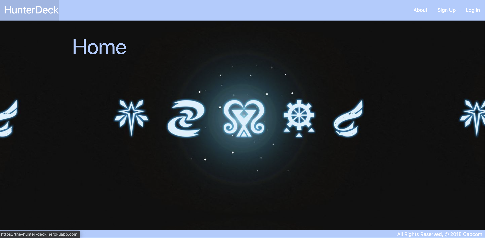
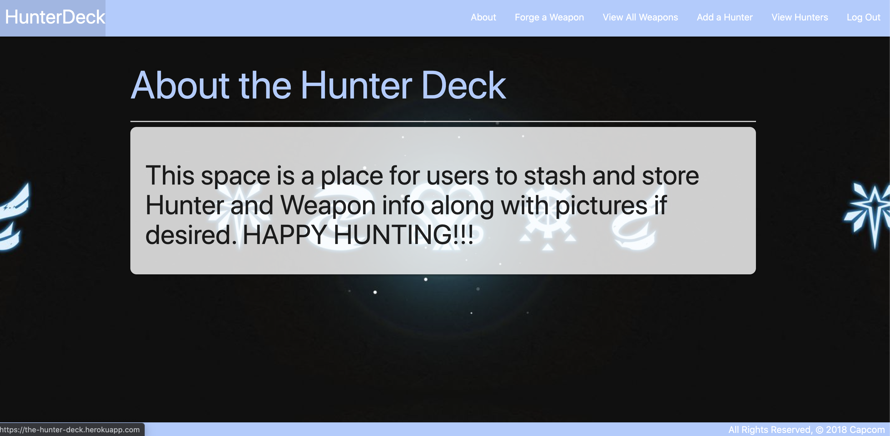
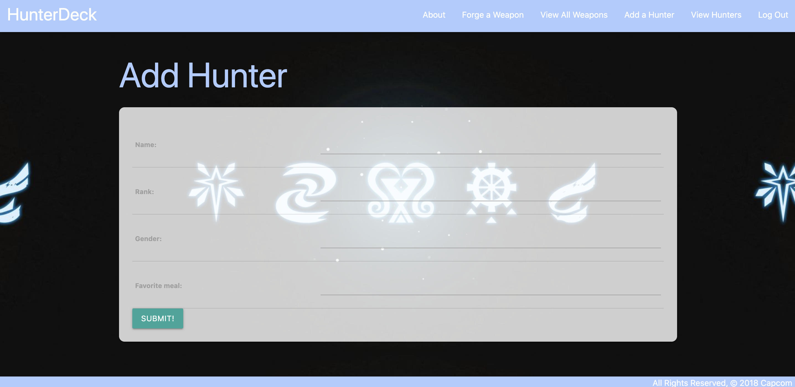

# The Hunter Deck

## Objective:
### - Create a website for users to store a collection of their hunters and weapons from Monster Hunter.
##
##
##
##
## Open app:
### Click [here](https://the-hunter-deck.herokuapp.com/) to go to the website.
##
##
## Motivation:
### Every Monster Hunter player needs a place to store their data from the franchises and this app is the place to do it! I wanted to create something where I can view my hutner at any time and add more data if need be.
##
##
## [Go to Trello Board](https://trello.com/b/3s8Ntl45/hunterdeck)

## Wireframes:

## ERD:

# Website View

##
### Home Page:

### About Page:

### Hunter List:

## Technology Used:
- CSS
- HTML
- Python
- Django
- AWS
- Javascript
- Materialize

## AAU I can:
- Sign up or log in
- Create a hunter
- Delete a hunter
- Edit a hunter
- Create, edit, and delete a weapon
- Display weapons on hunter details
- Equip and unequip weapons from hunters
- Add Photo to hunter details

## Stretch Goals
- Add specificity to weapon and hunter create form
- Sort Hunter list in order from highest rank to lowest
- Sort Weapon list in order from highest rarity to lowest
